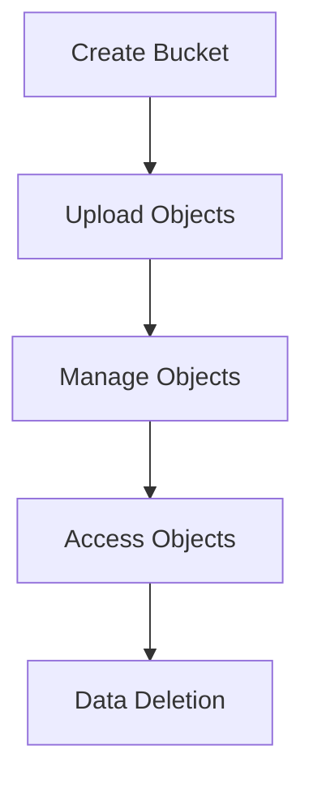
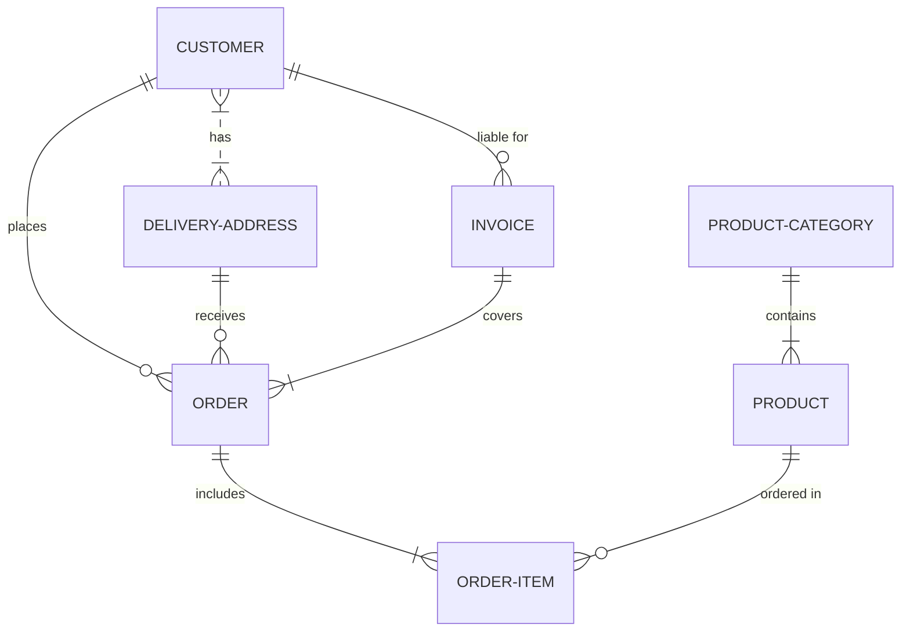

# AWS S3

**What:**

* **S3** stands for **Simple Storage Service**. It's a highly scalable and durable object storage service offered by AWS.
* S3 stores data as objects within containers called "buckets." Each object is a file (like images, videos, documents) and any associated metadata.

**Why:**

* **Scalability:** Easily store and retrieve any amount of data, from terabytes to exabytes.
* **Durability:** Designed for 11 9s of durability (99.999999999%), meaning extremely low risk of data loss.
* **Availability:** High availability ensures your data is accessible whenever you need it.
* **Cost-Effectiveness:** Pay only for the storage you use and the data transferred.
* **Flexibility:** Supports various use cases, including data archiving, website hosting, big data analytics, and more.

**Where Applied:**

* **Data Archiving:** Storing long-term data for backup and disaster recovery.
* **Website Hosting:** Hosting static websites and web applications.
* **Big Data Analytics:** Storing and processing large datasets for analytics and machine learning.
* **Mobile App Development:** Storing user-generated content, app updates, and other mobile app assets.
* **Backup and Recovery:** Backing up critical data from on-premises systems and other cloud services.

**How to Use:**

1. **Create an S3 Bucket:** Create a bucket in a specific AWS region.
2. **Upload Objects:** Upload your data (files) to the bucket.
3. **Manage Objects:** Organize objects using folders (virtually within the bucket), control access permissions, and manage object lifecycle.
4. **Access Objects:** Retrieve objects from the bucket using the AWS Management Console, AWS SDKs, or the AWS CLI.

**Lifecycle:**

1. **Data Creation:** Create or acquire the data to be stored.
2. **Data Upload:** Upload the data to an S3 bucket.
3. **Data Storage:** Store the data in S3, potentially using different storage classes for cost optimization.
4. **Data Access:** Retrieve and use the data as needed.
5. **Data Deletion (Optional):** Delete objects when no longer required.

**Diagram (Mermaid.js):**

**Related Services:**

* Amazon Glacier
* Amazon EBS
* Amazon FSx
* AWS Lambda

